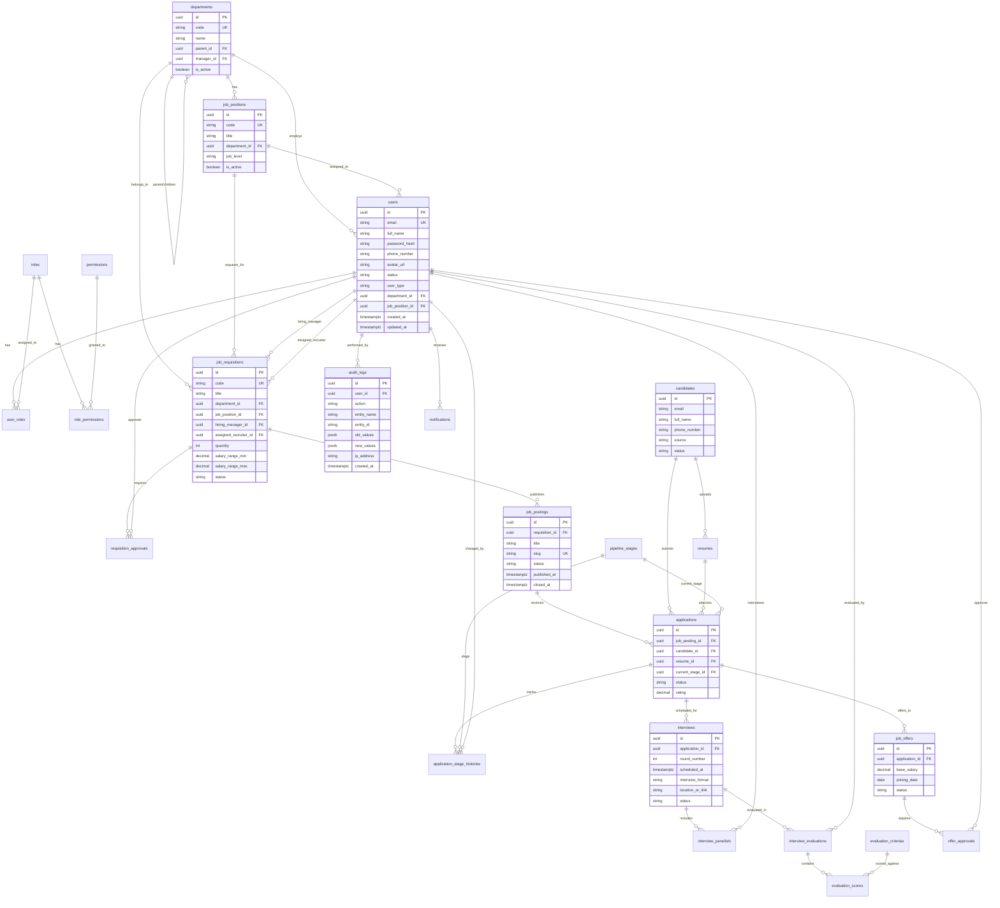

# SƠ ĐỒ THỰC THỂ QUAN HỆ (ERD) & BÁO CÁO NGHIỆM THU DATABASE ATS
> **Hệ thống Quản lý Tuyển dụng Nội bộ (ATS) — NoveraTech**  
> *Phiên bản: 1.0.0 — Database: PostgreSQL (Supabase)*

---

## 1. Sơ đồ ERD Tổng thể (Mermaid Diagram)

---

## 2. Bảng Đối Chiếu Tiến Độ Theo Sprint Tasks

| Mã Task | Tên Nhiệm Vụ | Trạng Thái Jira | Tình Trạng Thực Tế | Chi Tiết Nghiệm Thu Kỹ Thuật |
| :--- | :--- | :---: | :---: | :--- |
| **SCRUM-60** | Xác định các thực thể và bảng dữ liệu chính | **Đã xong** | **HOÀN THÀNH** | Đã tạo đủ 26 Entities bao phủ toàn bộ 9 Epics (User, Role, Org, Requisition, Posting, Candidate, Application, Interview, Offer, Audit, Email, Notification). |
| **SCRUM-57** | Thiết kế quan hệ giữa các bảng | **Đã xong** | **HOÀN THÀNH** | Thiết lập đầy đủ Foreign Keys, Composite Primary Keys (`UserRole`, `RolePermission`), Self-referencing (`Department`) và xóa theo tầng an toàn (`Restrict`/`SetNull`). |
| **SCRUM-58** | Xác định kiểu dữ liệu và ràng buộc cho từng trường | **Đã xong** | **HOÀN THÀNH** | Dùng `uuid` cho ID, `timestamptz` chuẩn UTC, `jsonb` cho payload động, các ràng buộc `IsUnique()` trên email, code, slug và composite key. |
| **SCRUM-59** | Chuẩn hóa cấu trúc dữ liệu | **Đã xong** | **HOÀN THÀNH** | Đạt chuẩn 3NF: Tách riêng bảng danh mục, tách `Candidate` khỏi `Application` (1 ứng viên nộp nhiều đơn), tách tiêu chí đánh giá khỏi điểm số. |
| **SCRUM-63** | Thiết kế cơ chế lưu vết và thời gian cập nhật dữ liệu | Công Việc | **HOÀN THÀNH** | Bảng `audit_logs` (lưu jsonb thay đổi `old_values`/`new_values`, IP, Agent), `application_stage_histories` theo dõi chuyển vòng, `BaseEntity` tự động lưu `CreatedAt`, `UpdatedAt`, `CreatedById`, `UpdatedById`, `IsDeleted` (Soft Delete). |
| **SCRUM-64** | Rà soát bảo mật và phân quyền truy cập dữ liệu | Công Việc | **HOÀN THÀNH** | Mô hình RBAC 5 bảng (`users`, `roles`, `permissions`, `user_roles`, `role_permissions`). Seed sẵn 7 roles chuẩn và permissions theo từng Epic. Mật khẩu băm an toàn, cờ `IsSystem` khóa role cốt lõi. |
| **SCRUM-56** | Thiết kế chỉ mục cho các truy vấn thường dùng | Công Việc | **HOÀN THÀNH** | Đã đánh index cho toàn bộ các cột tra cứu chính (`email`, `code`, `slug`, `status`) và tất cả các khóa ngoại (`FK`) trong migration `20260925064502_AddAtsSchema`. |
| **SCRUM-62** | Soạn thảo migration script tạo schema | Công Việc | **HOÀN THÀNH** | Đã hoàn thành file migration `20260925064502_AddAtsSchema.cs` (1.189 dòng C#) và áp dụng thành công (`dotnet ef database update`) lên PostgreSQL Supabase. |
| **SCRUM-61** | Xây dựng sơ đồ ERD của database | Công Việc | **HOÀN THÀNH** | Đã hoàn thiện sơ đồ ERD trực quan chi tiết bằng Mermaid trong tài liệu `docs/DATABASE_ERD.md`. |
| **SCRUM-65** | Kiểm tra và nghiệm thu thiết kế database | Công Việc | **HOÀN THÀNH** | Đã đồng bộ thành công CSDL, kiểm tra kết nối CSDL, seed data thành công, không xung đột khóa và bảo toàn toàn vẹn dữ liệu. |
